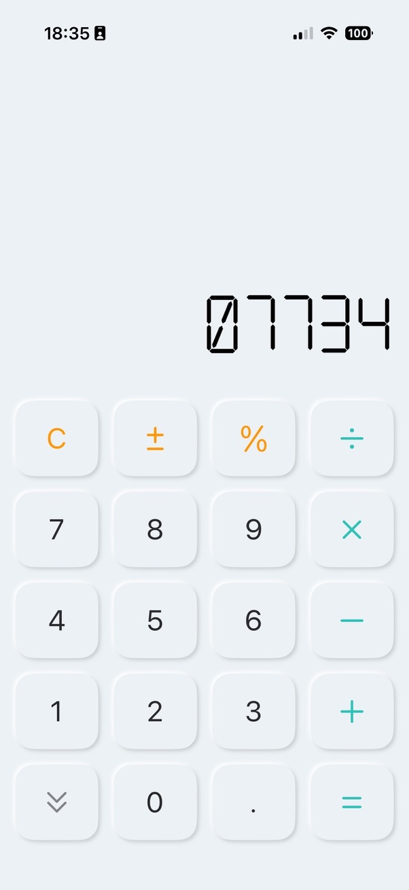
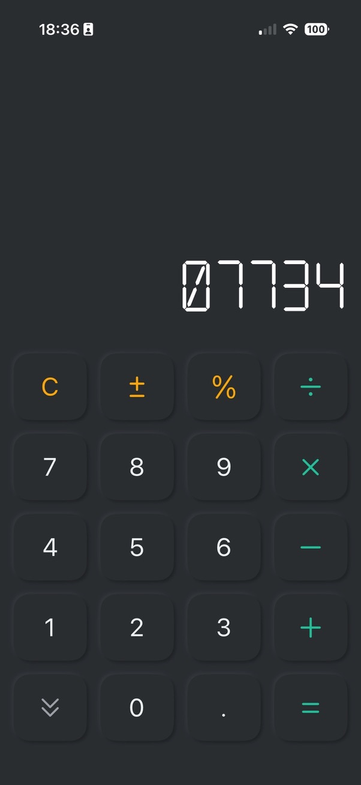

# RetroCalc

Serious calculator. Unserious agenda.

RetroCalc is a small iOS calculator with a chunky LCD display, soft tactile buttons, real arithmetic, and one very important feature: it helps you write calculator words upside down.

Type `07734`, flip your phone, become twelve years old again.

<p align="center">
  
  &nbsp;&nbsp;
  
</p>

## Why

I wanted a digital calculator that actually looked like a digital calculator.

I could not find one using a proper LCD-style font, so I made one. Then it became a way to show my kids one of my favourite old pastimes: typing numbers, flipping the calculator upside down, and discovering words hiding in plain sight.

They loved it.

So this is not a serious productivity tool. It is a personal, silly side project with my kids, made to show them that writing code, games, and apps can be playful. Also, calculators should calculate, yes, but they should also let you discover that `5318008` is not the only joke in the drawer.

It is still a working calculator, obviously. It does sums, handles the usual operators, and then quietly encourages nonsense when nobody is looking.

## Word Mode

There is a little in-app dictionary/reference for discovering calculator-spellable words. Pick one, and RetroCalc drops in the digit sequence that makes sense when the display is flipped.

Examples:

| Word | Input |
| --- | ---: |
| hello | `07734` |
| boss | `5508` |
| google | `376006` |

Useful? Debatable.

Necessary? Absolutely.

## Running

Open `RetroCalc.xcodeproj` in Xcode and run the `RetroCalc` scheme.

Fast model tests:

```sh
swift test
```

App build:

```sh
xcodebuild -project RetroCalc.xcodeproj -scheme RetroCalc -configuration Debug -derivedDataPath /tmp/RetroCalcDerivedData build
```

## License

No license file yet. For now, assume "look, learn, laugh, ask before shipping it somewhere serious."
